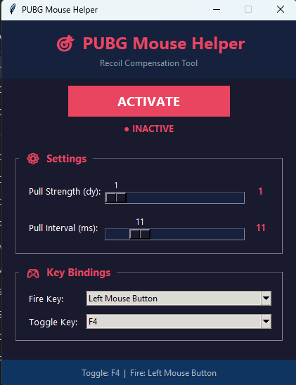

# 🎯 PUBG Mouse Helper

<div align="center">

**Recoil Compensation Tool for PUBG**

A lightweight Windows utility that automatically moves the mouse downward while the fire button is held, helping to compensate for weapon recoil.

[](LICENSE)
[]()
[]()

</div>

---

## 📸 Screenshot

<div align="center">



</div>

---

## 📥 Download & Install

### Option 1: Download the EXE (Recommended - No Python needed)
1. Go to the [**Releases**](../../releases) page
2. Download `PUBGMouseHelper.exe`
3. Run it — no installation required!

### Option 2: Run from source (requires Python)
```bash
git clone https://github.com/YOUR_USERNAME/Pubg-Mouse-Helper.git
cd Pubg-Mouse-Helper
python pubg_mouse_helper.py
```

---

## ✨ Features

| Feature | Description |
|---------|-------------|
| 🎯 **Recoil Compensation** | Automatically pulls the mouse down while the fire key is held |
| 🔘 **Activate/Deactivate** | One-click toggle button in the UI |
| 🎚️ **Pull Strength (dy)** | Adjustable slider (1–20) — controls how far the mouse moves per tick |
| ⏱️ **Pull Interval (ms)** | Adjustable slider (1–50) — controls the delay between each pull |
| 🎮 **Customizable Fire Key** | Choose any key/mouse button as the fire trigger |
| ⌨️ **Toggle Hotkey** | Press F6 (or custom key) to toggle without alt-tabbing |
| 💾 **Auto-Save Settings** | All settings are saved to `settings.json` and restored on startup |

---

## 🚀 How to Use

1. **Launch** the program
2. **Adjust** the Pull Strength and Pull Interval sliders to match your weapon
3. **Set** your Fire Key (default: Left Mouse Button)
4. **Click ACTIVATE** or press **F6** to enable
5. **Hold** the fire key in-game — the mouse will automatically pull down

### 💡 Tips
- Start with a low Pull Strength (2–4) and increase until recoil is balanced
- Lower Pull Interval = faster/smoother compensation
- Use the **Toggle Hotkey** (F6) to quickly enable/disable during gameplay
- Settings are saved automatically — they'll be there next time you open the app

---

## ⚙️ Settings

All settings are stored in `settings.json` next to the executable:

```json
{
  "pull_strength": 3,
  "pull_interval": 10,
  "fire_key": "Left Mouse Button",
  "toggle_key": "F6",
  "active": false
}
```

You can edit this file manually or use the GUI sliders.

---

## 🔧 Build EXE from Source

If you want to build the `.exe` yourself:

```bash
pip install pyinstaller
pyinstaller --onefile --noconsole --name PUBGMouseHelper --icon=icon.ico pubg_mouse_helper.py
```

The executable will be in the `dist/` folder.

---

## 📁 Project Structure

```
Pubg-Mouse-Helper/
├── pubg_mouse_helper.py    # Main application source code
├── screenshots/            # App screenshots for README
│   └── app_screenshot.png
├── settings.json           # Auto-generated settings file
├── README.md               # This file
├── LICENSE                 # MIT License
└── .gitignore              # Git ignore rules
```

---

## ⚠️ Disclaimer

This tool is for **educational purposes only**. Use it at your own risk. The developer is not responsible for any consequences resulting from the use of this software.

---

## 📄 License

This project is licensed under the MIT License — see the [LICENSE](LICENSE) file for details.

---

<div align="center">

**Made with ❤️ for the PUBG community**

</div>
